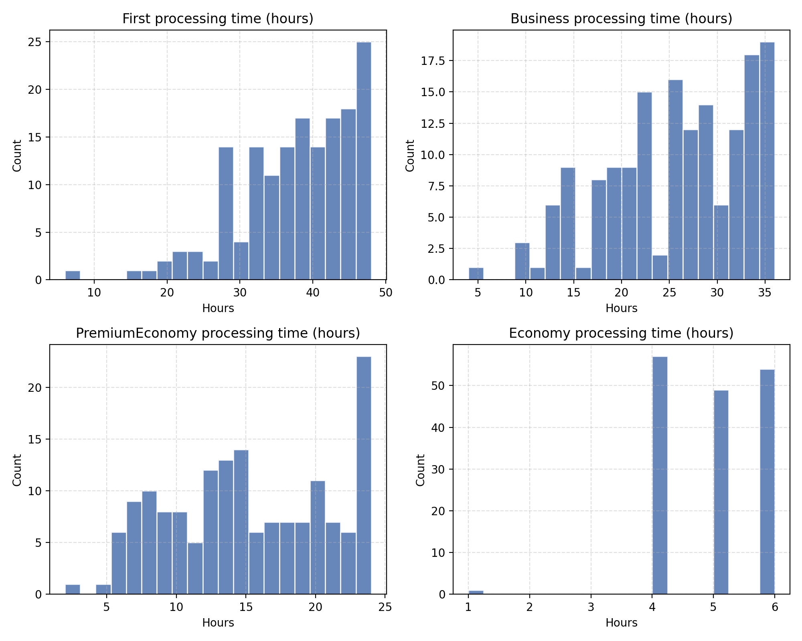
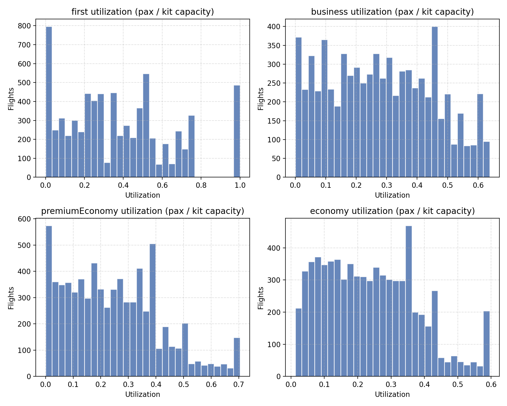

# Flight Rotables Optimisation

The link to the repo containing the challenge can be found [here](https://github.com/pradu3/HackitAll2025).

## Setup

```
python -m venv .venv
source .venv/bin/activate
```
Add all requirements to [requirements.txt](./requirements.txt). To install them:

```
pip install --upgrade pip
pip install -r requirements.txt
```

You need to create locally and `.env` file in order to be able to send requests.

```
cp .env.example .env
```

Inside the `.env` file, set the desired API key and the url base.

## Structure

- `src/main.py` - I envision this to be the entry point, the script in which we call the other modules and implement the final product. I want us to work as modularly as possible so that we can turn this into an api more easily later.
- `src/utils` - Module with data transfer objects necessary for the request
- `src/api_client` - Module that implements the `ApiClient` class with all the required methods.

## Statistics

The histogram of the time it takes to process a kit at each airport:



On the provided that, we can see the utilisation faction of kits (passenger=pax/kit space per plane)



The average and median values of needed kits can be found [here](./statistics/flight_kits_vs_capacity_summary.csv)

## Frontend (Flight Rotables Cockpit)

An interactive React + TypeScript + Tailwind + shadcn/ui dashboard lives in `frontend/`. It ships a hackathon-ready control center for the Flight Rotables Optimization stack, including dashboards, flights drill-down, airport inventory, and a strategy tuning lab with mock data and API stubs ready to swap to real endpoints.

### Quick start

```bash
cd frontend
npm install
npm run dev
# npm run build to verify prod bundle
```

### What’s inside

- React Router for navigation, TanStack Query for data fetching, Recharts for charts, Radix/shadcn components for UI primitives, Tailwind for styling with light/dark theme toggle.
- `src/lib/mock-data.ts` and `src/lib/api.ts` provide mock payloads and delay-simulated calls; wire them to real backend endpoints when available.
- Shared layout components under `src/components/layout` create the persistent sidebar + top bar shell. UI primitives live in `src/components/ui`.
- Feature folders:
  - `src/features/dashboard` — KPI strip, cost/penalty time series, penalty breakdown donut, network snapshot, and strategy summary.
  - `src/features/flights` — filter bar, sortable table, and a slide-over flight detail view with per-cabin service stats.
  - `src/features/airports` — airport list, stock/capacity gauges, trend and flow charts, and upcoming flights near each station.
  - `src/features/strategy` — tuning playground with sliders/toggles for heuristics, simulation runner, comparison KPIs, delta chart, and explainability notes.

### Notes for backend integration

- Replace functions in `src/lib/api.ts` with real HTTP calls; maintain the same shapes defined in `src/lib/types.ts`.
- React Query keys are already scoped per scenario/filters; hook your fetchers into those spots for cache-aware updates.
- Mock data uses round-level metrics; align your API responses to the same dimensions to reuse charts with minimal changes.

